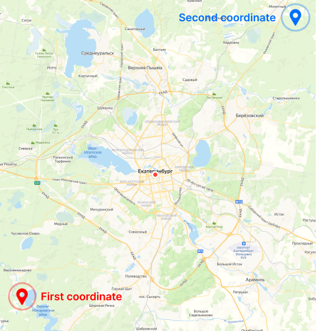

# tilesdownloader

English | [Русский](./README_RU.md)

## Synopsis
./tilesdownloader **[OPTION]** **[PARAMETER]** ...

## Syntax

```
./tilesdownloader -provider osm ...
```
```
./tilesdownloader --provider=osm ...
```

## Options

### provider [String]

You can use prepared providers. 

* *osm* - OpenStreetMap
* *otm* - Open Topo Map
* *osm-cycle* - OpenStreetMap Cycle
* *railway* - OpenRailwayMap


### provider-name [String]

You can specify provider name. You will need this when saving images. Can be used in conjunction with [provider](#provider-[string]).

Example:
```
... -provider-name MyProviderName
```
```
... -provider-name My Provider Name
```


### provider-link [String]

Specifying your own link to the provider for downloading tiles without a slash at the end.

Example:
```
... -provider-link http://b.tiles.openrailwaymap.org/standard
```

****

### (wip) output [String]

You can specify the absolute or relative path where the images will be downloaded. 

Example:
```
/home/user1/tiles
```
```
mydir
```

Default:
```
tiles
```

****

### pattern [String]

Saving files with a pattern-generated name. Keywords:
- %provider-name%
- %x%
- %y%
- %z%

All you need is to insert the above keywords in the required place. You can also choose not to add keywords that you don't need. But I do not advise you to remove the cocks, because if you do, the downloaded tiles will be overwritten by others at a higher level, so they will have the same names.

Example:
```
./tilesdownloader -provider osm -pattern %x%_%y%_%z%-%provider-name% -min-zoom 1 -max-zoom 2 -full-map
```

Result:
```
0_0_1-OpenStreetMap
```

By default, files will be sorted into folders without using a template.

****

### min-zoom [Unsigned Integer]

Lower zoom limit, in range 0..19.

Example:
```
... -min-zoom 6
```

Default: *6*

### max-zoom [Unsigned Integer]

Highest zoom limit, in range 0..19.

Example:
```
... -max-zoom 7
```

Default: *7*

****



**Attention!** To work with negative values, you must use the following syntax

```
... --fcoord-lat=-56.674619
```


### fсoord-lat [Double]

Latitude of first coordinate.

Example:
```
... --fсoord-lat=56.674619
```


### fсoord-lon [Double]

Longtitude of first coordinate.

Example:
```
... --fсoord-lon=60.287416
```


### sсoord-lat [Double]

Latitude of second coordinate.

Example:
```
... --sсoord-lat=57.029763
```

### sсoord-lon [Double]

Longtitude of second coordinate.

Example:
```
... --sсoord-lon=60.921877
```

****

### show-file-type

If you need the file extension in the name, use this option. The parameter with the file extension is not specified, since the image is always downloaded as a *PNG*.

****

### full-map

Download full map. Coordinates are not used.

Example:
```
./tilesdownloader -provider osm -full-map
```

****

### tile-res

The resolution of the saved images. Use it if you are not satisfied with the original permission.

Example:
```
./tilesdownloader -provider railway -full-map -tile-res 256
```