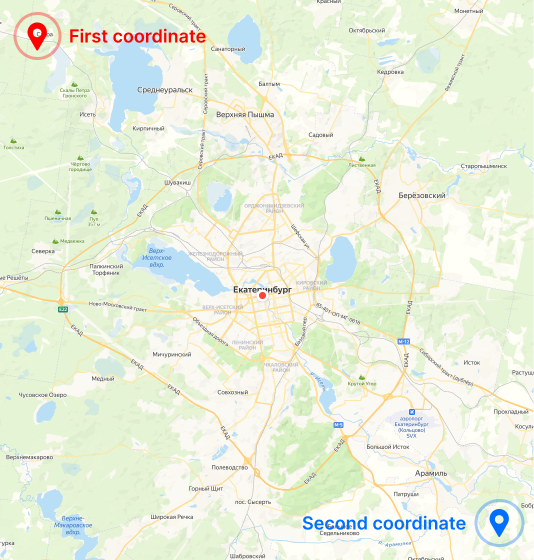

# tiledownloader

[English](./README.md) | Русский

## Синопсис
./tilesdownloader **[ОПЦИЯ]** **[ПАРАМЕТР]** ...

## Синтаксис

```
./tilesdownloader -provider osm ...
```
```
./tilesdownloader --provider=osm ...
```

## Опции

### provider [String]

Вы можете исопльзовать подготовленных провайдеров, у которых уже заполнены [provider-name](#provider-name) и [provider-link](#provider-link). 

* *osm* - OpenStreetMap
* *otm* - Open Topo Map
* *osm-cycle* - OpenStreetMap Cycle
* *railway* - OpenRailwayMap


### provider-name [String]

Вы можете указать имя провайдера. Оно понядобится при сохранении файлов. Можно использовать совместно с [provider](#provider-[string]), чтобы при сохранении применялось указанное имя.

Пример:
```
... -provider-name MyProviderName
```
```
... -provider-name My Provider Name
```


### provider-link [String]

Ссылка на провайдера, с которого будут скачиваться плитки. Указывается без слеша в конце. Нужно использовать в том случае, когда необходимого провайдера нет в списке подготовленных.

Пример:
```
... -provider-link http://b.tiles.openrailwaymap.org/standard
```

****

### (wip) output [String] 

Абсолютный или относительный путь для вывода программы. Если папки в пути отсутствуют, они будут созданы.

Пример:
```
/home/user1/tiles
```
```
mydir
```

По умолчанию:
```
tiles
```

****

### pattern [String]

Сохранение файлов с названием, сгенерированным по шаблону. Все файлы будут сохранены в одну папку. Ключевые слова:

- %provider-name%
- %x%
- %y%
- %z%

Всё что вам нужно, это подставить в необходимое место указанные выше ключевые слова. Вы также можете не добавлять ключевые слова, которые вам не нужны. Но я не советую убирать хуи я, ведь если вы это сделаете скачанные плитки будут затираться другими уровнем выше, так они будут иметь одинаковые имена.

Пример:
```
./tilesdownloader -provider osm -pattern %x%_%y%_%z%-%provider-name% -min-zoom 1 -max-zoom 2 -full-map
```

Результат:
```
0_0_1-OpenStreetMap
```

По умолчанию файлы будут отсортированы по папкам, не используя шаблон.

****

### min-zoom [Unsigned Integer]

Нижняя граница зума, в диапозоне 0..19.

Example:
```
... -min-zoom 6
```

По умолчанию: *6*

### max-zoom [Unsigned Integer]

Верхняя граница зума, в диапозоне 0..19.

Пример:
```
... -max-zoom 7
```

По умолчанию: *7*

****



**Важно!** Чтобы отрицательные значения координат учитывались, их необходимо указывать через следующий синтаксис:
```
... --fcoord-lat=-87.5
```

### fсoord-lat [Double]

Широта первой координаты.

Пример:
```
... --fсoord-lat=56.674619
```


### fсoord-lon [Double]

Долгота первой координаты.

Пример:
```
... --fсoord-lon=60.287416
```


### sсoord-lat [Double]

Широта второй координаты.

Пример:
```
... --fсoord-lat=57.029763
```

### sсoord-lon [Double]

Долгота второй координаты.

Пример:
```
... --fсoord-lat=60.921877
```

****

### show-file-type

Включение отображение расширения ```.png``` в названии файла. Расширение всегда *PNG*.

****

### full-map

Скачивание всей карты. Указанные координаты не учитываются.

Пример:
```
./tilesdownloader -provider osm -full-map
```

****

### tile-res

Разрешение сохраняемых изображений. Используйте, если оригинальное разрешение вас не устраивает.

Пример:
```
./tilesdownloader -provider railway -full-map -tile-res 256
```