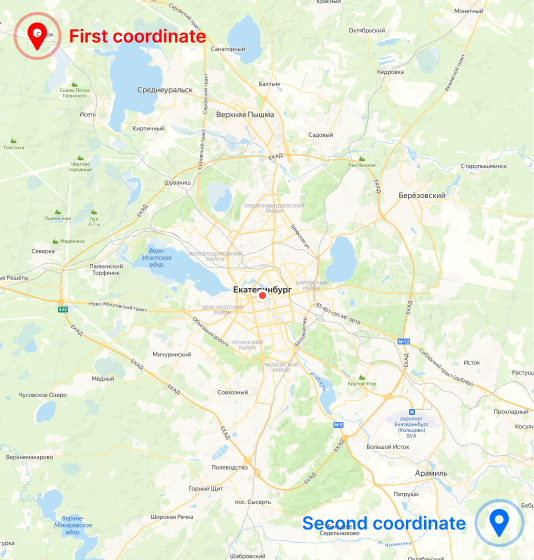

# Использование

🇬🇧 [English](./USAGE.md) | 🇷🇺 Русский 

## Синопсис
./tilesdownloader **[ОПЦИЯ]** **[ПАРАМЕТР]** ...


## Синтаксис

```
./tilesdownloader -provider osm ...
```
```
./tilesdownloader --provider=osm ...
```

## Опции

### provider [String]

Выбор провайдера, который будет предоставлять плитки. Список подготовленных провайдеров: 

* *osm-standard* - OpenStreetMap Standard
* *railway-standard* - OpenRailwayMap Standard
* *railway-maxspeed* - OpenRailwayMap Maxspeed
* *railway-electrification* - OpenRailwayMap Electrification


### providers [String]

Вы можете импортировать своих провайдеров, через конфигурациооный файл. 

Пример конфигурационного файла *custom_providers.ini*:

```ini
[Provider]
ident=osm-standard-local
name=OpenStreetMap-Mapnik
url=http://localhost:8080/tile/{z}/{x}/{y}.png
```

Пример:
```
... -providers custom_providers.ini -provider osm-standard-local
```


****

### layers [String] 

Абсолютный или относительный путь для вывода программы. Можно использовать макросы, которые при сохранении будут подменятся на реальные значения. Если папки в пути отсутствуют, они будут созданы.

Макросы:

* ``{p}`` - Имя провайдера
* ``{z}`` - Уровень зума
* ``{x}`` - X номера плитки
* ``{y}`` - Y номера плитки

Пример конфигурационного файла *layers.ini*:

```ini
[Layer]
provider=osm-standard
filter=grayscale

[Layer]
provider=railway-standard
```

Пример:
```
.. -layers layers.ini
```

По умолчанию:
```
tiles/{p}/{z}/{x}/{y}
```

****

### out [String] 

Абсолютный или относительный путь для вывода программы. Можно использовать макросы, которые при сохранении будут подменятся на реальные значения. Если папки в пути отсутствуют, они будут созданы.

Макросы:

* ``{p}`` - Имя провайдера
* ``{z}`` - Уровень зума
* ``{x}`` - X номера плитки
* ``{y}`` - Y номера плитки

Пример:
```
.. -out tiles/{p}/{z}/{x}_{y}
```

По умолчанию:
```
tiles/{p}/{z}/{x}/{y}
```

****

### min-zoom [Unsigned Integer]

> Обязательный параметр

Нижняя граница зума, в диапозоне 0..19.

Example:
```
... -min-zoom 6
```

### max-zoom [Unsigned Integer]

> Обязательный параметр

Верхняя граница зума, в диапозоне 0..19.

Пример:
```
... -max-zoom 7
```

По умолчанию: *7*

****



**Важно!** Чтобы отрицательные значения координат учитывались, их необходимо указывать через следующий синтаксис:
```
... --fcoord-lat=-56.674619
```

### left [Double]

Левая граница выбранной области (минимальная долгота).

Пример:
```
... --fсoord-lat=57.02137767
```


### top [Double]

Верхняя граница выбранной области (максимальная широта).

Пример:
```
... --fсoord-lon=120
```


### right [Double]

Правая граница выбранной области (максимальная долгота).

Пример:
```
... --fсoord-lat=42.7
```

### bottom [Double]

Нижняя граница выбранной области (минимальная широта).

Пример:
```
... --fсoord-lat=143.1
```

****

### show-file-type

Включение отображение расширения ```.png``` в названии файла. Расширение всегда *PNG*.

****

### skip-missing

Пропуск отсутствующих плиток при получении с сервера.

****

### filter

Наложение чёрно-белого фильтра к плиткам от ``provider``.

****

### tile-res [Unsigned Integer]

Разрешение сохраняемых изображений. Используйте, если оригинальное разрешение вас не устраивает.

Пример:
```
./tilesdownloader -provider railway -full-map -tile-res 256
```

****

### merge [String]

Объединение плиток двух разных провайдеров. Основным является тот, что указан через опцию [provider](#provider-[string]). Второй провайдер обязательно должен быть в списке встроенных. Разрешение итоговых плиток будет подстраиваться под основного провайдера или от [tile-res](#tile-res).

Пример:
```
./tilesdownloader -provider osm -merge railway -min-zoom 0 -max-zoom 5 -provider-name OpenRailwayMap-Standard -pattern %provider-name%_%x%_%y%_%z% -full-map
```